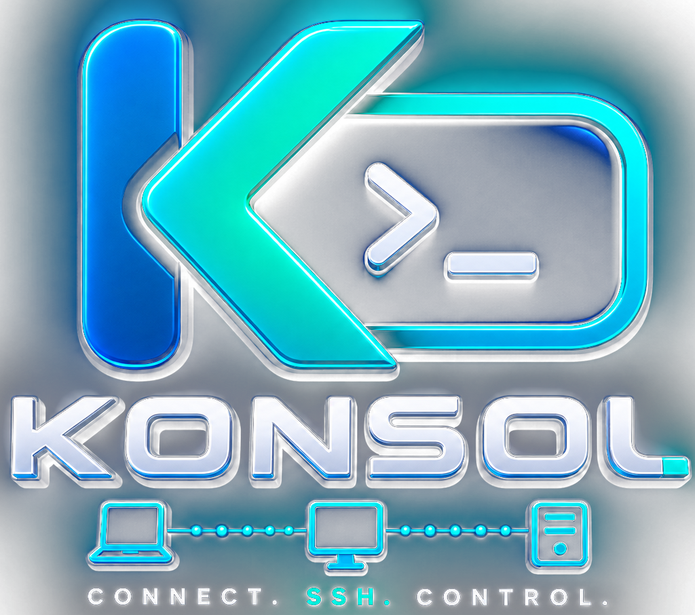

<div align="center">



# Konsol

**Premium SSH client for mobile — connect, control, conquer.**

[](https://flutter.dev)
[](https://dart.dev)
[](LICENSE)
[]()

---

Konsol is a beautifully crafted SSH terminal built with Flutter. Manage your servers on the go with a native, responsive UI — password or key-based auth, multi-session tabs, and credentials stored securely in the device keychain.

</div>

---

## Features

- **Host Management** — Add, edit, search, pin, and color-code your servers
- **SSH Terminal** — Full VT100 terminal powered by `xterm` with smooth rendering
- **Multi-Session Tabs** — Run multiple SSH sessions simultaneously
- **Secure Credentials** — Passwords and private keys stored in the device keychain via `flutter_secure_storage`
- **SSH Key Manager** — Generate and manage Ed25519 / RSA keys
- **Smart Path Completion** — Real-time remote path autocompletion
- **Quick Key Bar** — ESC, Tab, Ctrl+C, arrows, and common shell symbols at your fingertips
- **Terminal Themes** — Choose from Konsol, Tokyo Night, or classic Green on Black
- **Dark & Light Mode** — Full theme support with system auto-switch
- **Adjustable Font Size** — Fine-tune your terminal readability
- **Haptic Feedback** — Tactile responses for connections and actions

## Architecture

```
lib/
├── core/               # Design tokens, theme, utilities
├── data/               # Models (Host, SSHKey), repositories, secure storage
├── features/
│   ├── hosts/          # Host list, add/edit screens
│   ├── keys/           # SSH key management
│   ├── settings/       # App settings screen
│   └── terminal/       # Terminal controller, session view, path completer
├── router/             # GoRouter navigation config
└── main.dart           # App entry point
```

**State:** Riverpod · **Navigation:** GoRouter · **Local DB:** Hive · **SSH:** dartssh2 · **Terminal:** xterm

## Getting Started

### Prerequisites

- **Flutter SDK** `>=3.11.4` — [Install Flutter](https://docs.flutter.dev/get-started/install)
- **Dart SDK** (bundled with Flutter)
- **Android Studio** or **VS Code** with Flutter/Dart plugins
- **Xcode** (macOS only, for iOS builds)
- A physical device or emulator (iOS Simulator / Android Emulator)

### Installation

```bash
# 1. Clone the repository
git clone https://github.com/Ahmed1-Rebai/Konsol.git

# 2. Navigate into the project
cd Konsol

# 3. Install dependencies
flutter pub get

# 4. Run the app
flutter run
```

### Android Setup

1. Enable **Developer Options** and **USB Debugging** on your device
2. Connect via USB or set up wireless debugging
3. Run `flutter run` or build an APK:

```bash
# Debug APK
flutter build apk --debug

# Release APK
flutter build apk --release
```

The APK will be at `build/app/outputs/flutter-apk/app-release.apk`.

### iOS Setup

1. Open `ios/Runner.xcworkspace` in Xcode
2. Set your **Development Team** under Signing & Capabilities
3. Run on a connected iOS device or simulator:

```bash
# Run directly
flutter run

# Or build an IPA
flutter build ipa --release
```

> **Note:** iOS builds require a paid Apple Developer account for device installation.

## Tech Stack

| Layer | Technology |
|-------|-----------|
| UI Framework | Flutter |
| State Management | flutter_riverpod |
| Navigation | go_router |
| Local Database | Hive |
| Secure Storage | flutter_secure_storage |
| SSH Protocol | dartssh2 |
| Terminal Emulator | xterm |
| Cryptography | cryptography |
| Icons | lucide_icons |
| Fonts | JetBrains Mono |

## Security

- Passwords are encrypted and stored in the **device keychain** (Keychain on iOS, EncryptedSharedPreferences on Android)
- Private keys never leave the device
- No analytics, no telemetry, no cloud sync — your infrastructure stays yours

## Contributing

Contributions are welcome! Please open an issue first to discuss what you'd like to change.

```bash
# Fork & clone
git clone https://github.com/your-username/konsol.git

# Create a feature branch
git checkout -b feature/amazing-feature

# Commit & push
git commit -m "feat: add amazing feature"
git push origin feature/amazing-feature
```

## License

This project is licensed under the MIT License — see the [LICENSE](LICENSE) file for details.

---

<div align="center">

**Built with care for sysadmins, DevOps engineers, and anyone who lives in the terminal.**

</div>
